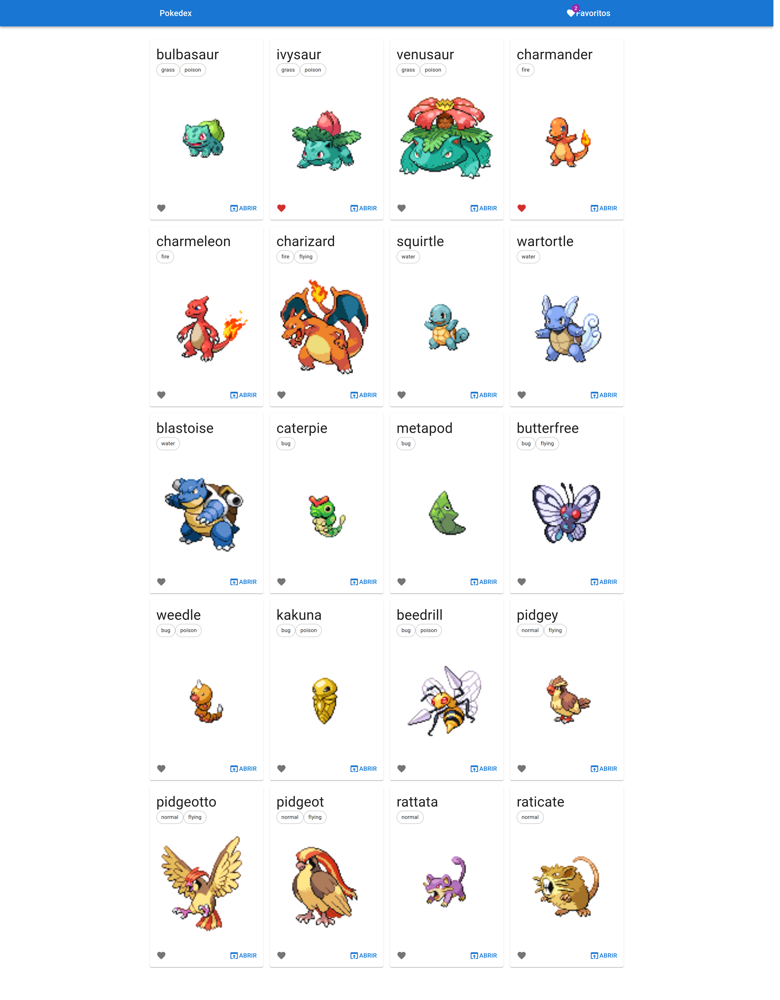

# Preview do projeto



## Projeto

Esse projeto consulta API **pokeapi.co** para exibição de pokemons

#

### Tecnologias Utilizados

<div>
    
    
    
</div>

#

### Funcionalidades

- [X] Consulta de `pokemons`
- [X] Consulta detalhada de um `pokemon`
- [X] Adicionar pokemon aos `favoritos`
- [X] Contagem de pokemons `favoritos`
- [X] Consulta de `pokemons` na página `favoritos`

#

### Como executar

Será necessário fazer o clone do projeto 

```
git clone https://github.com/estaeldev/pokedex.git
```
Instalar as dependências e executar o script de inicialização

```
yarn

yarn start
```

### Projeto de Demostração

Acesse o link abaixo para visualizar o projeto

*[pokedex-projeto](https://pokedex-project-2780a.web.app/)*

#